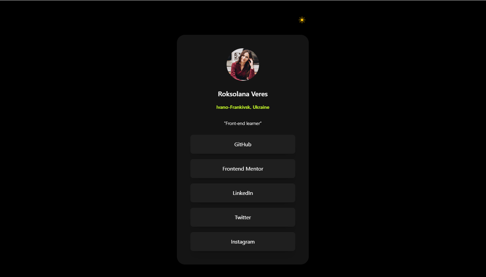
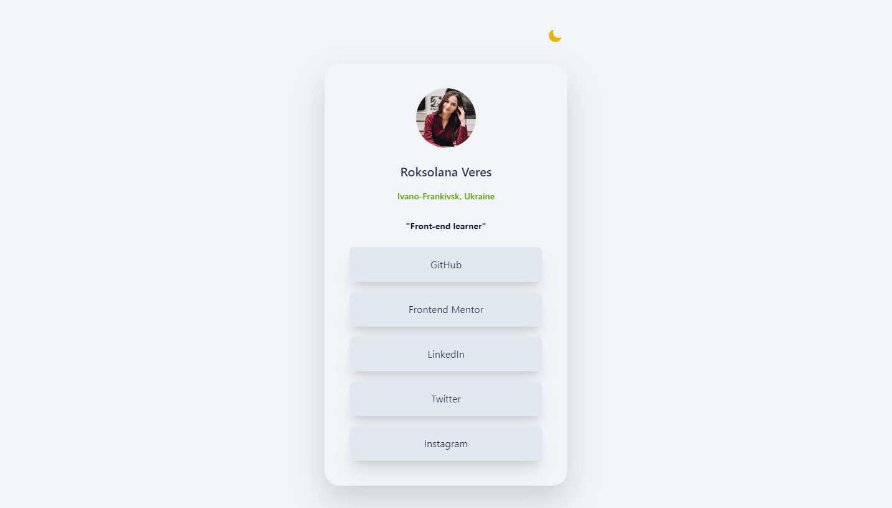
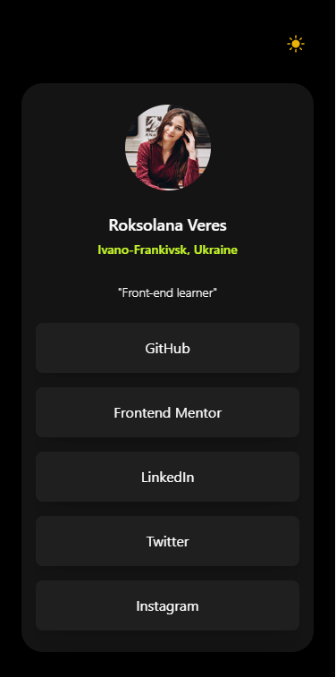
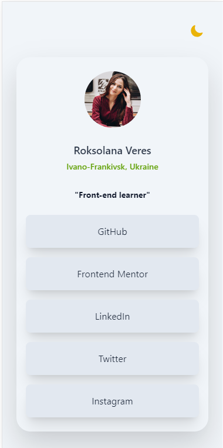
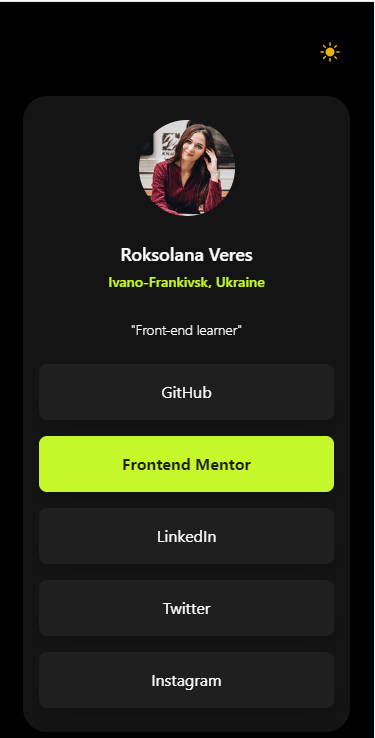

# Frontend Mentor - Social links profile solution

This is a solution to the [Social links profile challenge on Frontend Mentor](https://www.frontendmentor.io/challenges/social-links-profile-UG32l9m6dQ). Frontend Mentor challenges help you improve your coding skills by building realistic projects.

## Table of contents

- [Overview](#overview)
  - [The challenge](#the-challenge)
  - [Screenshots](#screenshots)
  - [Links](#links)
- [My process](#my-process)
  - [Built with](#built-with)
- [Author](#author)

## Overview

### The challenge

Users should be able to:

- See hover and focus states for all interactive elements on the page

### Screenshots

### Links

- [Frontend Mentor solution](https://www.frontendmentor.io/solutions/responsive-landing-page-built-with-tailwind-css-EVKz84zD3N)
- [GitHub repo](https://github.com/RoksolanaVeres/Social_links_profile-REACT)
- [Live Site](https://social-links-profile-react.vercel.app/)

## My process

### Built with

- Tailwind CSS
- React

## Author

- Frontend Mentor - [@RoksolanaVeres](https://www.frontendmentor.io/profile/RoksolanaVeres)
